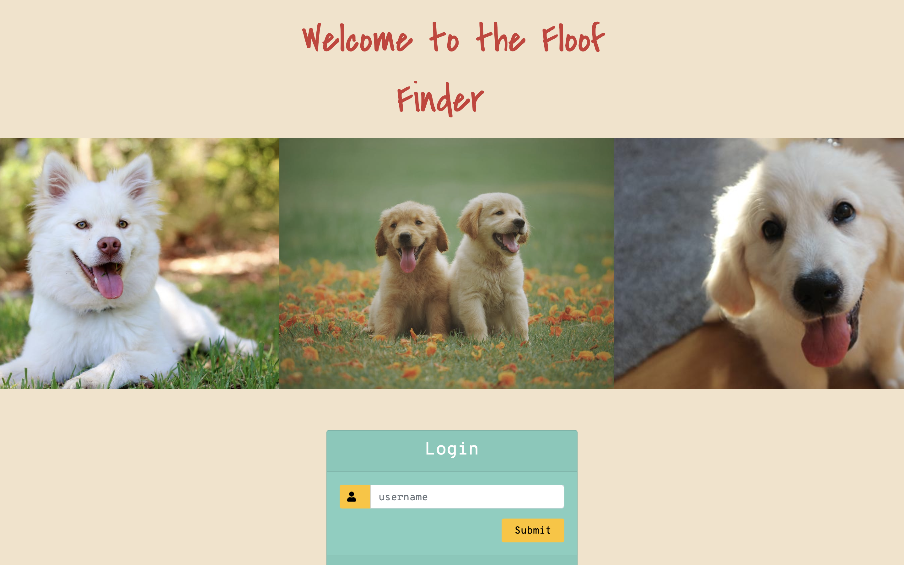
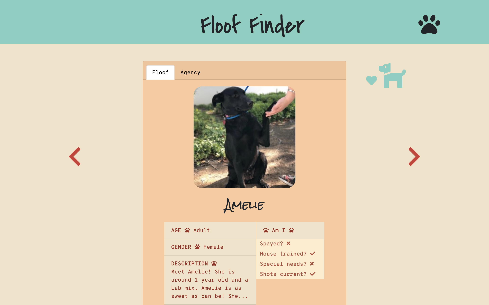

## Floof Finder
Floof Finder is a single page web application to find shelter dogs for adoption and collect their information!
  

 - Transported real-time data from PetFinder API
 - Designed frontend with Javascript and styled with Bootstrap framework along with custom CSS
 - Backend built with Ruby on Rails

 ### To start the application:
  1. run 'bundle install'
  2. run 'rails s' (should be localhost 3000)
  3. run 'cd fluffinder_frontend'
  4. run 'open index.html'

#### To see a full demo, please look at: https://youtu.be/HCt2VD8V_h0

